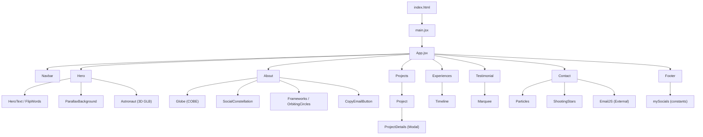

<p align="center">
  
</p>

<h1 align="center">My Portfolio</h1>

<p align="center">
  <em>An immersive, space-themed personal portfolio built with React, Three.js, and modern web technologies.</em>
</p>

<p align="center">
  
  
  
  
  
</p>

---

## Table of Contents

- [Overview](#-overview)
- [Live Demo](#-live-demo)
- [Features](#-features)
- [Architecture](#-architecture)
- [Tech Stack](#-tech-stack)
- [Project Structure](#-project-structure)
- [Getting Started](#-getting-started)
- [Environment Variables](#-environment-variables)
- [Available Scripts](#-available-scripts)
- [Design Decisions](#-design-decisions)
- [Component Reference](#-component-reference)
- [3D Assets & Credits](#-3d-assets--credits)
- [Deployment](#-deployment)
- [Performance Optimization](#-performance-optimization)
- [Browser Support](#-browser-support)
- [License](#-license)

---

## Overview

A premium, space-themed developer portfolio that blends **3D WebGL rendering**, **parallax backgrounds**, **canvas-driven particle effects**, and **glassmorphic UI** into a single-page React application. Every section is crafted to deliver a visually stunning, interactive experience that reflects modern frontend engineering capabilities.

---

## Live Demo

> _Coming soon — deploy to [Vercel](https://vercel.com), [Netlify](https://netlify.com), or [GitHub Pages](https://pages.github.com)._

---

## Features

| Feature | Description |
|---|---|
| **3D Astronaut Model** | Animated `.glb` spaceman rendered via React Three Fiber with mouse-tracking camera rig |
| **Parallax Hero** | Multi-layer mountain + planet parallax background driven by scroll position |
| **Particle System** | Custom canvas-based particle engine with mouse magnetism effects |
| **Shooting Stars** | Real-time canvas meteor shower with gradient trails and glow effects |
| **Interactive Globe** | COBE-powered 3D globe with drag interaction and location markers |
| **Social Constellation** | Floating social media badges in a "gravitational orbit" layout around a portrait |
| **Orbiting Tech Stack** | Dual-ring orbiting circles showcasing technology icons |
| **Flip Words Animation** | Letter-by-letter text animation for hero section keywords |
| **Project Modals** | Animated modals with spring physics, keyboard/backdrop close, and scroll lock |
| **Testimonial Marquee** | Infinite-scrolling review cards with pause-on-hover |
| **Scroll-Driven Timeline** | Work experience timeline with scroll-progress gradient indicator |
| **Contact Form** | Glassmorphic form with EmailJS integration, shimmer effects, and form validation |
| **Copy-to-Clipboard** | One-click email copy button with animated success state |
| **Responsive Design** | Fully responsive from mobile to ultra-wide screens |

---

## Architecture

```
┌─────────────────────────────────────────────────────────┐
│                      index.html                         │
│                   (Entry Point)                         │
└─────────────┬───────────────────────────────────────────┘
              │
              ▼
┌─────────────────────────────────────────────────────────┐
│                    main.jsx                             │
│              (React DOM Root)                           │
└─────────────┬───────────────────────────────────────────┘
              │
              ▼
┌─────────────────────────────────────────────────────────┐
│                     App.jsx                             │
│              (Section Orchestrator)                     │
├─────────────────────────────────────────────────────────┤
│  Navbar │ Hero │ About │ Projects │ Experiences │       │
│  Testimonial │ Contact │ Footer                        │
└────────┬─────┬──────┬───────┬──────┬──────┬─────┬──────┘
         │     │      │       │      │      │     │
         ▼     ▼      ▼       ▼      ▼      ▼     ▼
    ┌──────────────────────────────────────────────────┐
    │              Components Layer                     │
    ├──────────────────────────────────────────────────┤
    │  Astronaut (3D)  │  ParallaxBackground           │
    │  HeroText        │  FlipWords                    │
    │  Globe (COBE)    │  SocialConstellation          │
    │  Frameworks      │  OrbitingCircles              │
    │  Project         │  ProjectDetails (Modal)       │
    │  Timeline        │  Marquee                      │
    │  Particles       │  ShootingStars                │
    │  CopyEmailButton │  Alert                        │
    │  Card            │  Loader                       │
    └──────────────────────────────────────────────────┘
              │
              ▼
    ┌──────────────────────────────────────────────────┐
    │            Constants / Data Layer                  │
    ├──────────────────────────────────────────────────┤
    │  myProjects  │  mySocials  │  experiences        │
    │  reviews     │  SOCIAL_LINKS                     │
    └──────────────────────────────────────────────────┘
```

### Data Flow



---

## Tech Stack

### Core Framework
| Technology | Version | Purpose |
|---|---|---|
| **React** | 19.2.6 | UI component library |
| **Vite** | 8.0.12 | Build tool & dev server |
| **TailwindCSS** | 4.3.0 | Utility-first CSS framework |

### 3D & Graphics
| Technology | Version | Purpose |
|---|---|---|
| **Three.js** | 0.184.0 | WebGL 3D rendering engine |
| **React Three Fiber** | 9.6.1 | React renderer for Three.js |
| **React Three Drei** | 10.7.7 | Useful helpers for R3F |
| **COBE** | 0.6.4 | Interactive 3D globe |

### Animation & Interaction
| Technology | Version | Purpose |
|---|---|---|
| **Motion (Framer Motion)** | 12.40.0 | Declarative animation library |
| **Maath** | 0.10.8 | Math utilities for 3D (easing, damping) |

### Utilities
| Technology | Version | Purpose |
|---|---|---|
| **EmailJS** | 4.4.1 | Client-side email sending |
| **tailwind-merge** | 3.6.0 | Intelligent Tailwind class merging |
| **react-responsive** | 10.0.1 | Media query hooks for responsive logic |

### Dev Tools
| Technology | Version | Purpose |
|---|---|---|
| **ESLint** | 10.3.0 | Code linting |
| **@vitejs/plugin-react** | 6.0.1 | React HMR & JSX support |

---

## Project Structure

```
MyPortfolio/
├── public/
│   ├── assets/
│   │   ├── logos/              # 35 technology/brand SVG & PNG icons
│   │   ├── projects/           # 6 project screenshot images
│   │   ├── socials/            # Social media icons + profile photo
│   │   ├── sky.jpg             # Hero parallax sky background
│   │   ├── mountain-{1,2,3}.png  # Parallax mountain layers
│   │   ├── planets.png         # Parallax planets overlay
│   │   ├── coding-pov.png      # About section background image
│   │   └── ...                 # UI icons (arrows, menu, close, copy, grid)
│   ├── models/
│   │   └── tenhun_falling_spaceman_fanart.glb  # 3D astronaut model (~2.9MB)
│   └── vite.svg
├── src/
│   ├── components/
│   │   ├── Alert.jsx           # Toast notification component
│   │   ├── Astronaut.jsx       # 3D astronaut model (GLTF loader)
│   │   ├── Card.jsx            # Draggable card component
│   │   ├── CopyEmailButton.jsx # Copy-to-clipboard email button
│   │   ├── FlipWords.jsx       # Animated word cycling component
│   │   ├── Frameworks.jsx      # Orbiting tech stack display
│   │   ├── Globe.jsx           # Interactive COBE globe
│   │   ├── HeroText.jsx        # Hero section typography
│   │   ├── Loader.jsx          # 3D model loading progress
│   │   ├── Marquee.jsx         # Infinite scrolling marquee
│   │   ├── OrbitingCircles.jsx # Circular orbit animation
│   │   ├── ParallaxBackground.jsx  # Multi-layer parallax
│   │   ├── Particles.jsx       # Canvas particle system
│   │   ├── Project.jsx         # Project card with modal trigger
│   │   ├── ProjectDetails.jsx  # Project detail modal
│   │   ├── ShootingStars.jsx   # Canvas shooting star effect
│   │   ├── SocialConstellation.jsx # Social media badge layout
│   │   └── Timeline.jsx        # Scroll-driven work timeline
│   ├── constants/
│   │   └── index.js            # Project data, socials, experiences, reviews
│   ├── sections/
│   │   ├── About.jsx           # About section (5 grid cells)
│   │   ├── Contact.jsx         # Contact form with EmailJS
│   │   ├── Experiences.jsx     # Work experience timeline
│   │   ├── Footer.jsx          # Footer with social links
│   │   ├── Hero.jsx            # Hero section with 3D astronaut
│   │   ├── Navbar.jsx          # Fixed navigation bar
│   │   ├── Projects.jsx        # Project showcase
│   │   └── Testimonial.jsx     # Client testimonials marquee
│   ├── App.jsx                 # Root component / layout
│   ├── index.css               # Global styles, design tokens, animations
│   └── main.jsx                # React DOM entry point
├── .env                        # Environment variables (NOT committed)
├── .env.example                # Template with placeholder values
├── .gitignore                  # Git ignore rules
├── .npmrc                      # NPM configuration
├── eslint.config.js            # ESLint configuration
├── index.html                  # HTML entry point
├── package.json                # Dependencies & scripts
├── vite.config.js              # Vite configuration
└── README.md                   # This file
```

---

## Getting Started

### Prerequisites

- **Node.js** ≥ 18.0.0
- **npm** ≥ 9.0.0 (or yarn/pnpm)
- A modern browser with WebGL support

### Installation

```bash
# 1. Clone the repository
git clone https://github.com/PushkarShinde/MyPortfolio.git
cd MyPortfolio

# 2. Install dependencies
npm install

# 3. Set up environment variables
cp .env.example .env
# Edit .env with your actual values (see Environment Variables section)

# 4. Start the development server
npm run dev
```

The app will be available at `http://localhost:5173` (Vite default).

---

## Environment Variables

This project uses **Vite environment variables** (prefixed with `VITE_`) for configuration. Create a `.env` file in the root directory:

| Variable | Description | Where to Get |
|---|---|---|
| `VITE_EMAILJS_SERVICE_ID` | EmailJS service identifier | [EmailJS Dashboard](https://dashboard.emailjs.com/) → Email Services |
| `VITE_EMAILJS_TEMPLATE_ID` | EmailJS email template ID | [EmailJS Dashboard](https://dashboard.emailjs.com/) → Email Templates |
| `VITE_EMAILJS_PUBLIC_KEY` | EmailJS public API key | [EmailJS Dashboard](https://dashboard.emailjs.com/) → Account → API Keys |
| `VITE_CONTACT_EMAIL` | Your contact email address | Your personal/professional email |
| `VITE_CONTACT_NAME` | Your display name for emails | Your name |

> **Important:** The `.env` file is excluded from version control via `.gitignore`. Only `.env.example` (with placeholder values) is committed.

> **Note:** Since this is a client-side app, all `VITE_` variables are bundled into the final JavaScript. The EmailJS public key is designed to be client-safe, but never place truly secret server-side keys here.

---

## Available Scripts

| Command | Description |
|---|---|
| `npm run dev` | Start Vite development server with HMR |
| `npm run build` | Create production build in `dist/` |
| `npm run preview` | Preview the production build locally |
| `npm run lint` | Run ESLint across the project |

---

## Design Decisions

### Visual Theme: Deep Space

The portfolio adopts a **deep space / cosmic** aesthetic throughout:

- **Color Palette** — Custom Tailwind theme with carefully curated dark colors:
  - `primary (#030412)` — Near-black base
  - `midnight (#06091f)` — Dark navy backgrounds
  - `lavender (#7a57db)` — Primary accent
  - `aqua (#33c2cc)` — Secondary accent
  - `coral (#ea4884)` — Highlight accent
  - `royal (#5c33cc)` — CTA backgrounds

- **Typography** — [Funnel Display](https://fonts.google.com/specimen/Funnel+Display) (Google Fonts) — a modern display font with variable weight support (300–800).

### Glassmorphism

Multiple components use **glassmorphic styling** (semi-transparent backgrounds + backdrop-blur) to create depth:
- Contact card with animated border pulse
- Social constellation badges
- Project modal overlay

### Animation Philosophy

- **Entrance animations** — Elements use Framer Motion variants with staggered delays for a cinematic reveal
- **Scroll-driven** — The timeline uses `useScroll` + `useTransform` for progress indicators
- **Physics-based** — Spring animations throughout (stiffness/damping) for natural motion
- **Canvas-based** — Particle effects and shooting stars use raw `<canvas>` for performance

### 3D Strategy

- The 3D astronaut uses **React Three Fiber** with `Suspense` + a loading indicator
- Mouse position is used for subtle camera rig movement (parallax depth effect)
- The COBE globe runs independently on its own canvas for isolation

### Grid Layout (About Section)

The About section uses a **5-cell responsive grid** with distinct visual treatments:

| Grid | Content | Background Style |
|---|---|---|
| Grid 1 | Bio + coding image | Space wallpaper + cinematic overlay |
| Grid 2 | Social constellation | Space wallpaper + floating badges |
| Grid 3 | Time zone + globe | Space wallpaper + COBE globe |
| Grid 4 | CTA (Hire Me) | Purple gradient + shimmer sweep |
| Grid 5 | Tech stack orbits | CSS-generated starfield |

---

## Component Reference

### Sections (Page-Level)

| Component | File | Description |
|---|---|---|
| `Navbar` | `sections/Navbar.jsx` | Fixed nav with mobile hamburger menu (Framer Motion slide) |
| `Hero` | `sections/Hero.jsx` | Full-height hero with 3D astronaut, parallax, and animated text |
| `About` | `sections/About.jsx` | 5-cell grid with globe, social links, tech stack, CTA |
| `Projects` | `sections/Projects.jsx` | Project list with mouse-following preview image |
| `Experiences` | `sections/Experiences.jsx` | Scroll-driven work timeline |
| `Testimonial` | `sections/Testimonial.jsx` | Dual-row marquee testimonial cards |
| `Contact` | `sections/Contact.jsx` | Contact form over particles + shooting stars |
| `Footer` | `sections/Footer.jsx` | Social icons, brand, copyright |

### UI Components

| Component | File | Description |
|---|---|---|
| `Astronaut` | `components/Astronaut.jsx` | GLTF-loaded 3D spaceman with animation playback |
| `ParallaxBackground` | `components/ParallaxBackground.jsx` | 4-layer scroll-driven parallax |
| `HeroText` | `components/HeroText.jsx` | Responsive hero text with entrance animations |
| `FlipWords` | `components/FlipWords.jsx` | Cycling word animation (per-letter) |
| `Globe` | `components/Globe.jsx` | COBE 3D interactive globe with markers |
| `SocialConstellation` | `components/SocialConstellation.jsx` | Floating social badges in orbit layout |
| `Frameworks` | `components/Frameworks.jsx` | Dual-ring orbiting tech icons |
| `OrbitingCircles` | `components/OrbitingCircles.jsx` | CSS orbit animation with SVG path |
| `Project` | `components/Project.jsx` | Project row with modal trigger |
| `ProjectDetails` | `components/ProjectDetails.jsx` | Accessible modal with keyboard, scroll lock |
| `Timeline` | `components/Timeline.jsx` | Scroll-aware timeline with progress bar |
| `Particles` | `components/Particles.jsx` | Canvas particle system with mouse magnetism |
| `ShootingStars` | `components/ShootingStars.jsx` | Canvas meteor shower with glow trails |
| `Marquee` | `components/Marquee.jsx` | Infinite CSS scroll animation |
| `CopyEmailButton` | `components/CopyEmailButton.jsx` | Clipboard API email copy |
| `Alert` | `components/Alert.jsx` | Animated toast notification |
| `Card` | `components/Card.jsx` | Draggable card (image or text) |
| `Loader` | `components/Loader.jsx` | 3D model loading progress display |

---

## 3D Assets & Credits

| Asset | Author | License | Source |
|---|---|---|---|
| Falling Spaceman (GLB) | [wallmasterr](https://sketchfab.com/wallmasterr) | [CC-BY-4.0](http://creativecommons.org/licenses/by/4.0/) | [Sketchfab](https://sketchfab.com/3d-models/tenhun-falling-spaceman-fanart-9fd80b6a259f41fd99e6f56eee686dc5) |

> If you use this project as a template, please maintain attribution for all third-party assets.

---

## Deployment

### Vercel (Recommended)

```bash
# Install Vercel CLI
npm i -g vercel

# Deploy
vercel

# Set environment variables in the Vercel dashboard:
# Settings → Environment Variables → Add each VITE_* variable
```

### Netlify

```bash
# Build command: npm run build
# Publish directory: dist
# Add environment variables in Site Settings → Environment Variables
```

### GitHub Pages

```bash
# Install gh-pages
npm install --save-dev gh-pages

# Add to package.json scripts:
# "deploy": "npm run build && gh-pages -d dist"

# Set base in vite.config.js:
# base: '/MyPortfolio/',

npm run deploy
```

### Docker

```dockerfile
FROM node:18-alpine AS build
WORKDIR /app
COPY package*.json ./
RUN npm ci
COPY . .
RUN npm run build

FROM nginx:alpine
COPY --from=build /app/dist /usr/share/nginx/html
EXPOSE 80
CMD ["nginx", "-g", "daemon off;"]
```

---

## Performance Optimization

- **3D Model Preloading** — `useGLTF.preload()` fetches the astronaut model early
- **Suspense Boundaries** — 3D content wrapped in `<Suspense>` with a progress loader
- **Canvas Isolation** — Particle effects, shooting stars, and globe each run on dedicated canvases
- **Debounced Resize** — Window resize handlers are debounced (200ms) to prevent layout thrashing
- **Animation Cleanup** — All `requestAnimationFrame` loops and event listeners are cleaned up in `useEffect` return
- **Code Splitting** — Vite automatically tree-shakes and code-splits the production bundle
- **Image Optimization** — Consider converting large PNGs/JPGs to WebP for production

---

## Browser Support

| Browser | Support |
|---|---|
| Chrome 90+ |  Full |
| Firefox 90+ |  Full |
| Safari 15+ |  Full |
| Edge 90+ |  Full |
| Mobile Chrome |  Full |
| Mobile Safari |  Full (iOS 15+) |

> **Note:** WebGL is required for the 3D astronaut model. Devices without GPU acceleration may experience reduced performance.

---

## License

This project is open source and available under the [MIT License](LICENSE).

---

<p align="center">
  <strong>Built with ❤️ by Pushkar Shinde</strong><br/>
  <sub>If you find this useful, consider giving it a ⭐ on GitHub!</sub>
</p>
